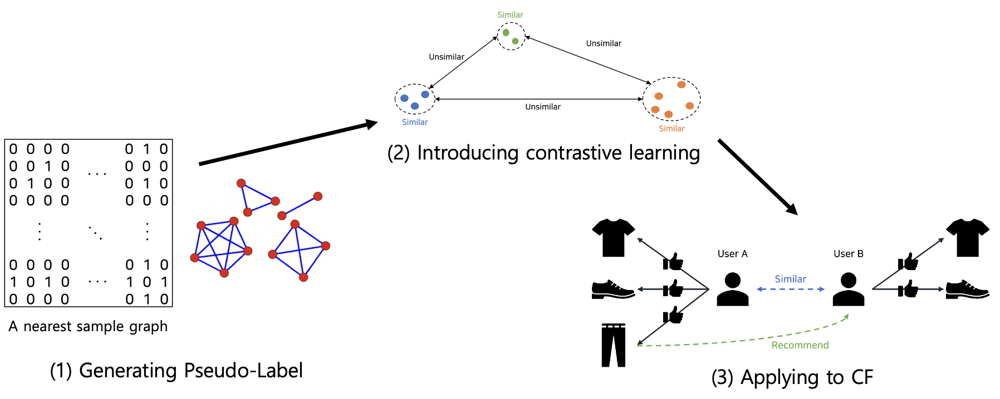

This repository contains PyTorch evaluation code, training code and pretrained models for Collaborative Filtering with Contrastive Learning.

For details see [Collaborative Filtering with Contrastive Learning](https://drive.google.com/file/d/13OCPVtxSA6A8jF4oOdLe79F-4jmC45UW/view?usp=share_link) by Hawon Jeong, Saemee Choi, Sohyun Jeong.



## Data preprocessing
To run the code, you probably need to add datasets in data/dataset/ and run following ipynb.
```
notebooks/store_features_task1.ipynb
notebooks/store_features_task2.ipynb
```

## Train
```
python train.py --gpu_ids 1 --dataset task1
python train.py --gpu_ids 1 --dataset task2
```
## Pre-trained weights

|          | BatchSize | Epochs | Task  |
|----------|:----:|:---:|:---:|
|  WCL | 256 | 20  | task1 | [wcl_task1.pth]() |
|  WCL | 256 | 20  | task2 | [wcl_task2_pth]() |

## Visualize
```
notebooks/DM_visualize_representation_sample_label.ipynb
notebooks/DM_visualize_representation_without_label.ipynb
```

## Baseline
```
/baselines/task1_vanilla_cf.ipynb
/baselines/task2_vanilla_cf.ipynb
```
If you want to test the pretained model, please download the weights from the link above, and move it to the checkpoints folder (create one if you don't have .checkpoints/ directory).
